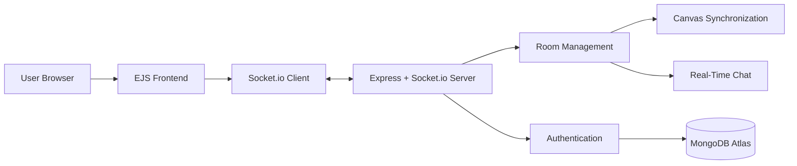
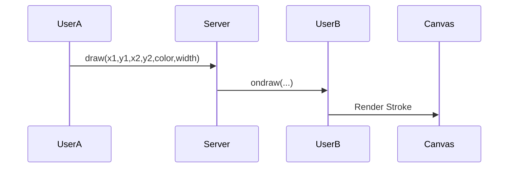

# SyncBoard

SyncBoard is a full-stack, real-time collaborative workspace built using Node.js, Express.js, Socket.io, and MongoDB Atlas. It enables authenticated users to create shared drawing rooms, collaborate on a synchronized whiteboard, communicate through integrated room chat, and maintain consistent canvas state across connected clients.

## 🚀 Live Demo

**Live Application:** https://syncboard-ualb.onrender.com

> Note: The application is deployed on Render's free tier. If the service has been idle, the initial request may take 30-50 seconds while the container wakes up.

---

## ✨ Features

### Real-Time Collaborative Whiteboard

* Multi-user synchronized drawing using Socket.io
* Adjustable brush size and color selection
* Instant propagation of drawing events to connected clients
* Room-based collaboration using unique board IDs

### Multiplayer Undo System

* Local canvas history management using a stack-based approach
* Keyboard shortcut support (`Ctrl + Z`)
* Consistent undo behavior across all connected clients

### Global State Synchronization

* Force-sync protocol to prevent client state divergence
* Base64 canvas snapshots broadcast to all room members
* Automatic correction of desynchronized canvases

### Real-Time Room Chat

* Integrated room-specific messaging sidebar
* Instant message delivery through WebSockets
* Separate handling of incoming and outgoing messages

### Authentication & Security

* User registration and login system
* Password hashing using bcrypt
* Session-based authentication using express-session
* MongoDB-backed user management

---

## 🛠️ Tech Stack

### Frontend

* EJS
* HTML5
* CSS3
* Vanilla JavaScript

### Backend

* Node.js
* Express.js
* Socket.io

### Database

* MongoDB Atlas
* Mongoose ODM

### Authentication

* bcrypt
* express-session
* cookie-parser

### Deployment

* Render

---

## 🏗️ System Architecture



---

## ⚡ Real-Time Drawing Flow



---

## 📦 Installation

### Clone Repository

```bash
git clone https://github.com/thisiskartik05/SyncBoard.git
cd SyncBoard
```

### Install Dependencies

```bash
npm install
```

### Configure Environment Variables

Create a `.env` file in the root directory:

```env
MONGO_URI=your_mongodb_atlas_connection_string
SESSION_SECRET=your_session_secret
PORT=3000
```

### Start Development Server

```bash
npm start
```

Application will be available at:

```text
http://localhost:3000
```

---

## 📂 Project Structure

```text
SyncBoard
│
├── database/
├── routes/
├── public/
├── views/
├── utils/
│
├── server.js
├── package.json
└── README.md
```

---

## 🔮 Future Improvements

* Persistent whiteboard state storage
* Board version history
* Collaborative sticky notes
* Voice communication integration
* Redis-backed scaling for large rooms
* Drawing replay functionality

---

## 🤝 Contributing

Contributions, issue reports, and feature suggestions are welcome.

1. Fork the repository
2. Create a feature branch
3. Commit your changes
4. Open a Pull Request

---

## 📜 License

This project is licensed under the MIT License.
